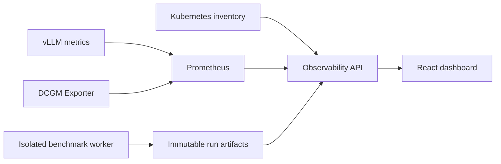

# Inference and GPU observability dashboard

Status: specified; standalone interactive demo delivered. Live integrations and benchmark execution are future implementation work.

## Product and scope

Build **gpup**, an operator console for self-hosted LLM serving. Primary users are inference engineers investigating latency regressions and platform engineers managing GPU capacity. The first live release supports vLLM, NVIDIA DCGM Exporter, and Prometheus. Other serving engines require explicit adapters; metric names are never assumed interchangeable.

This is an independent project at `/mnt/c/users/hawxxx/gpup`. Use Go and React for the proposed live implementation. The standalone HTML prototype at `index.html` makes the design reviewable without installing dependencies.

Approaches considered: embedding Grafana is fast but limits the intended workflow and visual control; a custom telemetry store adds operational complexity; a lightweight custom UI over Prometheus provides focused workflows while retaining established collection infrastructure. Select the third approach.

## Operator workflows

1. Overview: select deployment and time window; inspect request rate, output tokens/s, p95 TTFT, and error rate. Compare latency and traffic against the same preceding interval. Inspect queue depth and GPU saturation before forming a diagnosis.
2. GPU fleet: inspect utilization, framebuffer allocation, temperature, power, and hardware errors by device. Drill into device history and associated replicas. MIG instances and parent devices use distinct identities to prevent double counting.
3. Benchmarks: compare immutable runs with identical model, workload, and SLO contracts. Open the manifest, latency distributions, quality checks, and failure counts. Mark incomparable runs explicitly.

Filters are URL-addressable in the live product. Time changes refresh all panels consistently. No valid samples means unavailable, never zero. Loading preserves panel geometry; partial errors retain successful panels; stale data includes its timestamp and a retry control. Demo mode is labeled persistently.

## Metric contract

| Measure | Definition and presentation |
| --- | --- |
| Request rate | Completed requests / second, with successes and failures distinguished; counter rates handle resets |
| Output throughput | Generated output tokens / second; input tokens are a separate series |
| TTFT | Time from request receipt to first streamed token; adapter declares server or client timing boundary |
| ITL | Inter-token latency distribution; do not substitute mean time per output token |
| End-to-end latency | Request receipt through final response; p50/p95/p99 aggregated from histogram buckets |
| Goodput | Requests / second satisfying the declared TTFT, decode, and success contract; requires joint per-request observations |
| Queue | Waiting requests and queue-time histogram, separate from running requests |
| KV cache | Engine cache occupancy and prefix cache hit rate with source-specific definitions |
| GPU busy | DCGM device utilization; does not establish useful work or tensor efficiency |
| GPU profiling | SM activity, tensor activity, memory bandwidth activity only when supported and enabled |
| GPU memory | Used framebuffer bytes / total framebuffer bytes; separate from memory-copy utilization |
| GPU health | Temperature, watts, XID events and supported ECC counters; unsupported counters remain unavailable |
| Efficiency | Output tokens per joule for a declared measurement boundary; dollars per million tokens only with an explicit cost model |

Compute fleet quantiles from summed compatible histogram buckets, never by averaging replica percentiles. Never derive goodput from unrelated marginal histograms. Rate windows must contain at least four scrape samples. Histogram schema changes require compatible conversion or separate series. Percentages use weighted numerators and denominators when aggregation warrants it.

## Collection and service architecture

Use Go for a dedicated observability API, following repository conventions. The browser receives normalized series from the service and never receives datasource credentials. Inventory maps deployment, replica, node, GPU UUID, and MIG instance. Ambiguous attribution displays unknown rather than joining on a guessed pod label. Adapter capability discovery records engine/exporter versions and actual exposed metric families.

Endpoints: `GET /api/inference/overview`, `GET /api/inference/gpus`, `GET /api/inference/series`, `GET /api/inference/benchmarks`, and `GET /api/inference/benchmarks/{id}`. Parameters are deployment, start, end, and bounded step. Responses contain `mode`, `observedAt`, `window`, `capabilities`, `warnings`, and values whose absent samples are null. Series points contain timestamp and value. Every measurement declares unit and source.

Allowlist metric queries server-side. Cap a response at 20 series, 600 points per series, 512 KiB uncompressed, and a 30-day interactive range. Use five-second query deadlines and a maximum of eight datasource requests per page refresh. Coalesce identical requests, cache for one refresh interval, cancel obsolete fetches, pause refresh in hidden tabs, and expose partial datasource failures independently. Use 15-second scrape and refresh defaults; mark a source stale after 45 seconds without a sample. Historical windows do not auto-refresh.

RBAC: viewers inspect dashboards and completed runs; operators submit bounded benchmark jobs in authorized nonproduction targets; administrators configure datasources and policies. Benchmark launch requires backend authorization, quotas, cancellation, target allowlists, and audit records. Prompts and outputs never enter telemetry labels. Trace correlation uses sampled IDs; request IDs and user IDs are prohibited metric labels.

## Visual specification

Use a midnight navy canvas, restrained teal for healthy metrics, amber for attention, and coral for failures. White text and muted slate labels form hierarchy. Avoid decorative gauges and charts without units. Use system fonts, tabular numbers, thin borders, and 12–16px panel radii. Dense desktop content should still have 24px section spacing.

Desktop: 220px navigation, compact top toolbar, four KPI cards, a wide latency chart, a queue/throughput summary, and a GPU table. Tablet: collapsed navigation and two KPI columns. Mobile below 640px: horizontal section navigation, stacked cards, and horizontally scrollable device tables inside a named region. Support 360px widths without page overflow.

Every chart has a text summary and accessible data alternative. All controls have visible focus, keyboard operation, and labels. Status uses text plus color. Aim for WCAG 2.2 AA; respect reduced motion. The prototype includes working tabs, workload filters, time ranges, and accessible SVG chart titles. It demonstrates layout and interaction, not telemetry connectivity.

## Performance and benchmark acceptance

All values below are targets, not measured results. Frontend initial route budget: 150 KiB compressed JavaScript, 40 KiB compressed CSS, no required external fonts; LCP <=2.5s, INP <=200ms, CLS <=0.1 at p75 on declared devices. Test a 360px viewport under a midrange mobile CPU/network profile and a 1440px desktop profile. Chart updates should stay under 50ms main-thread time; heap growth after a 30-minute refresh soak should be <=10 MiB following garbage collection.

Service target: p95 cached overview <=300ms; p95 uncached overview <=2s with 100 concurrent viewers, 1,000 GPUs in inventory, and 20 returned series. Query cost scales with refreshes and visible panels; benchmark telemetry overhead against an uninstrumented baseline and target <=2% serving throughput reduction under the same workload.

Inference benchmark protocol:

- Record hardware SKU/count, GPU memory, topology, driver/CUDA, engine/container digest, model revision, tokenizer, quantization, parallelism, context limit, scheduler, batch settings, and cache policy.
- Use sanitized deterministic workloads covering input/output lengths 128/128, 1,024/256, and 8,192/512, plus a declared mixed distribution. Record seeds, request count, corpus digest, actual output lengths, and cache hit behavior.
- Warm up for at least two minutes until stable; measure ten minutes; repeat five times. Report median and variability across runs and confidence intervals where sample size supports them.
- Run closed-loop concurrency sweeps 1, 4, 16, 64 and open-loop offered-load sweeps, recording scheduled and actual send times to expose coordinated omission and client saturation. Report errors, cancellations, timeouts, and omitted samples.
- Example workload SLO: TTFT <=500ms and per-request mean decode token time <=50ms for the short workload. Label these chosen acceptance thresholds, not universal model standards. Also report token-level ITL quantiles separately.
- Evaluate quality against a pinned reference and a workload-specific tolerance before accepting speed improvements. Record power over the same steady-state interval; disclose missing devices and shared host overhead.
- Store run manifest, raw timing observations without sensitive content, histogram buckets, summary, quality report, and tool versions. Reject comparisons when key configuration or workload fields differ unless the difference is the explicitly tested variable.

Use vLLM serving benchmarks for engine diagnostics and MLPerf LoadGen when implementing the applicable official workload and scenario. Custom workloads are internal benchmarks; do not label them MLPerf compliant or claim industry-leading performance without audited comparable results.

Failure coverage includes exporter missing, unsupported profiling, broker-independent datasource timeout, counter reset, histogram mismatch, zero traffic, stale samples, deployment restart, GPU replacement, unknown pod attribution, and an interrupted benchmark. Browser acceptance covers loading, empty, partial failure, stale, keyboard, narrow viewport, and successful filter changes.

## Sources

Reviewed 2026-10-04. Source versions must be pinned when implementing adapters.

- [vLLM production metrics](https://docs.vllm.ai/en/latest/usage/metrics/): serving metric families and semantic distinctions.
- [NVIDIA DCGM Exporter metrics](https://docs.nvidia.com/datacenter/dcgm/latest/reference/dcgm-exporter-metrics.html): runtime inventory and capability discovery.
- [NVIDIA DCGM profiling](https://docs.nvidia.com/datacenter/dcgm/latest/learn/modules/profiling.html): hardware activity counters and collection constraints.
- [MLPerf submission guide](https://docs.mlcommons.org/inference/submission/): LoadGen and scenario-dependent submission requirements.
